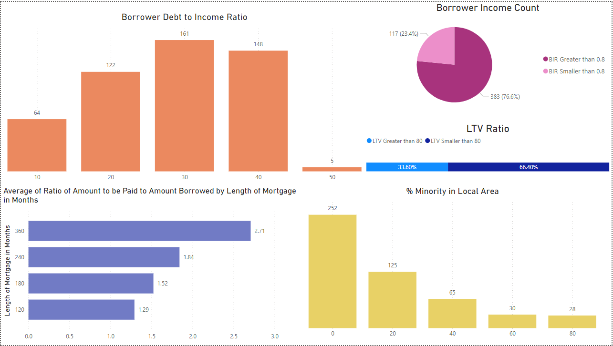
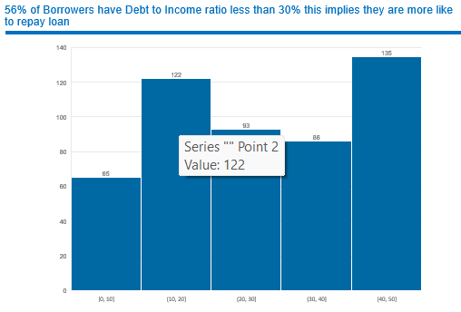
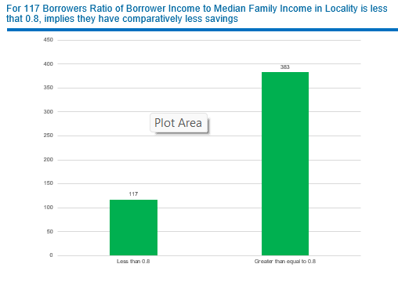

# Home Mortgage Default Analysis

## Objective
- Predict home loan default risks using machine learning models.
- Provide actionable insights for better loan underwriting and risk management.

### Dashboard

### Process Map

### DIR

### BIR

## Key Features
1. **Debt to Income (DTI) Ratio**: Shows borrower distribution and impact on repayment likelihood.
2. **Borrower Income Count (BIR)**: Highlights savings levels through BIR analysis.
3. **Loan-to-Value (LTV) Ratio**: Identifies borrowers with higher risk based on LTV.
4. **Mortgage Length Impact**: Analyzes repayment amounts over varying mortgage durations.
5. **% Minority in Local Area**: Provides socio-economic context.

## Insights
- **DTI Ratio**: 56% have DTI below 30%, indicating better repayment likelihood.
- **BIR**: 23.4% have low savings (BIR < 0.8).
- **LTV Ratio**: 66.4% have LTV below 80, reducing lender risk.
- **Mortgage Length**: Longer durations increase total repayment.
- **Minority Representation**: 85 areas have over 50% minority populations.

## Tools
- **Data Analysis**: Excel
- **Visualization**: Power BI, Tableau

## Benefits
- Reduces underwriting time by 80%.
- Enhances risk assessment accuracy.
- Enables faster loan approvals and cost savings.
